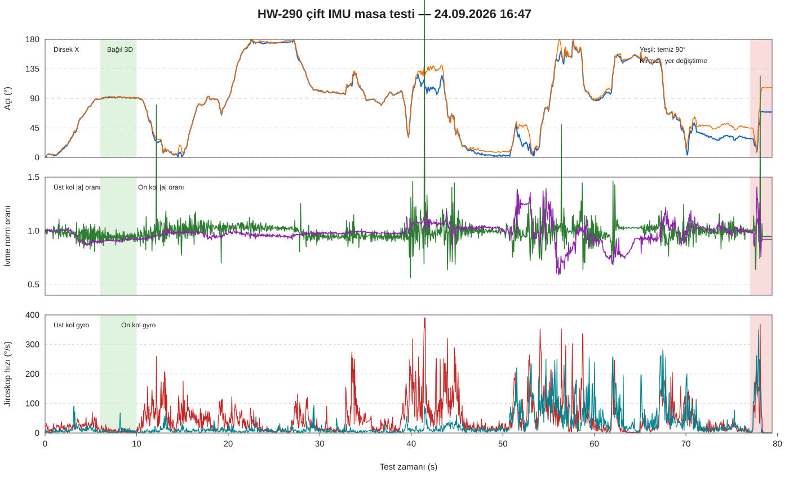

# HW-290 Çift IMU Masa Testi Analiz Raporu

## 1. Kayıt bilgisi

- Kayıt: `hw290_elbow_20260924_164722.jsonl`
- Tarih: 24 Eylül 2026
- Toplam örnek: 3.950
- Kayıt süresi: 79,415 saniye
- Gerçek ortalama hız: 49,74 Hz
- Medyan örnek aralığı: 19,993 ms
- I²C hata kaydı: 0
- Sensörler: 2 × HW-290; MPU `0x68`, HP5883 `0x2C`
- Füzyon: 6DOF Madgwick; manyetometre yalnızca tanı amacıyla kaydedildi

## 2. Kalibrasyon başlangıcı

| Ölçüm | Üst kol | Ön kol | Değerlendirme |
|---|---:|---:|---|
| Jiroskop ofseti X | -0,71 °/s | -0,77 °/s | Kullanılabilir |
| Jiroskop ofseti Y | -0,35 °/s | -5,22 °/s | Ön kol ofseti yüksek |
| Jiroskop ofseti Z | -0,50 °/s | -1,63 °/s | Yazılımla çıkarılıyor |
| Jiroskop gürültüsü | 3,61 °/s | 3,92 °/s | Kalibrasyon sırasında hareket edilmiş |
| İvme normu | 9,91 m/s² | 16,05 m/s² | Ön kol ölçeği hatalı |

İki kart da bu testte veri üretmiştir. Önceki kayıttaki üst sensörün sıfır veri sorunu yeniden oluşmamıştır. Güç kayıtları iki kart için de `PWR_MGMT_1=0x01`, `PWR_MGMT_2=0x00` olarak doğrulanmıştır.

Başlangıçtaki yerçekimi vektörleri arasında 46,34° bulunmuştur. Yazılım bu pozu sıfır kabul etmiştir. Masa testinde kullanılabilir olsa da giyilebilir sistemde iki kasanın +X eksenleri ilgili kemik boyunca mekanik olarak hizalanmalıdır.

## 3. Açı doğruluğu

### Temiz 90° beklemesi

Testin 6–10. saniyeleri en temiz sabit 90° bölümüdür.

| Sonuç | Değer |
|---|---:|
| Ortalama dirsek X açısı | 91,26° |
| Standart sapma | 0,75° |
| Medyan | 91,37° |
| Minimum–maksimum | 88,63–92,71° |
| Ortalama toplam 3B açı | 91,48° |

Bu bölümde 90° hedefe göre ortalama hata yaklaşık +1,26°'dir. Masa deneyi için başarılıdır.

### 180° beklemesi

Testin 22–27. saniyelerindeki bekleme:

| Sonuç | Değer |
|---|---:|
| Ortalama dirsek X açısı | 174,84° |
| Standart sapma | 1,85° |
| Medyan | 174,99° |
| Ortalama toplam 3B açı | 176,09° |

180° hedefte yaklaşık -5,16° hata vardır. Jiroskop ölçeği, doygunluk ve başlangıç kalibrasyonundaki hareket bu hataya katkı sağlar.

### Başlangıç pozuna dönüş

46–50. saniyelerde başlangıç pozuna yakın dönüşte:

- Dirsek X ortalaması: 5,50°
- Dirsek X medyanı: 4,09°
- Toplam 3B açı ortalaması: 10,57°

Bu değer yaklaşık 4–6° sıfır dönüş hatası ve daha büyük bir yönelim sürüklenmesi bulunduğunu gösterir. Tek bir kısa deneme için kullanılabilir, hassas ZED füzyonu için iyileştirilmelidir.

## 4. Sensörlerin yer değiştirilmesi

Sensörlerin fiziksel olarak yer değiştirilmesi yaklaşık 77–78. saniyede açıkça görülür:

- Üst sensör açısal hızı yaklaşık 314°/s seviyesine çıkmıştır.
- Ön kol sensörü yaklaşık 280°/s seviyesine çıkmıştır.
- Son sabit durumda dirsek X açısı 69,23° ±0,20° olmuştur.
- Aynı durumda toplam 3B açı 106,36° ±0,10° olmuştur.

Bu sonuç beklenir. Kalibrasyon aşağıdaki sabit dönüşümlere bağlıdır:

1. Hangi fiziksel sensörün üst kola ait olduğu
2. Hangi sensörün ön kola ait olduğu
3. Sensörün kasa içindeki yönü
4. Kasanın kol üzerindeki yönü
5. Başlangıç nötr pozu

Sensör yeri veya kasa yönü değişirse nötr quaternion ve sensör–segment dönüşümü artık geçerli değildir. Sabit kasa bunu büyük ölçüde çözer. Kasa çıkarılıp tekrar takılırsa yeniden nötr kalibrasyon yapılmalıdır.

## 5. Örnekleme ve iletişim kalitesi

- Medyan çevrim: 19,993 ms
- Yüzde 95 çevrim: 20,150 ms
- Hedef: 20 ms / 50 Hz
- I²C hatası: 0
- Tek büyük zaman boşluğu: 35,08. saniyede 431 ms

Genel örnekleme düzenlidir. 431 ms boşluk sırasında yazılım `dt` değerini 50 ms ile sınırlar; bu boşluk hareket sırasında oluşursa dönüşün bir bölümü kaybolabilir. Üretim sürümünde veri toplama ile dosya yazma farklı iş parçalarına ayrılmalı ve zaman boşlukları kalite bayrağıyla ZED füzyonuna bildirilmelidir.

## 6. Ölçek ve doygunluk

Kod iki sensörü `±2g` ve `±250°/s` olarak çalıştırmıştır.

- Üst sensörde 39 örnekte en az bir jiroskop ekseni sınıra ulaşmıştır: %0,99.
- Ön kol sensöründe 18 örnekte sınıra ulaşılmıştır: %0,46.
- İvme kayıtlarında ±19,613 m/s² sınır değerleri görülmüştür; bu ±2g doygunluğudur.
- Üst sensör ivme oranı çoğunlukla 0,87–1,11 arasındadır.
- Ön kol sensör ivme oranı çoğunlukla 0,80–1,10 arasındadır; başlangıç normu 16,05 m/s² olduğu için fiziksel ölçeği doğru değildir.

Hızlı kol hareketleri için `±4g` ve `±500°/s` daha uygundur. Ancak bu HW-290 klonları standart aralık ayarını tutarsız uyguladığı için önce her kartın gerçek hassasiyeti deneysel olarak ölçülmeli, ardından kart başına ölçek katsayısı kullanılmalıdır.

## 7. Quaternion ve füzyon sağlığı

- Üst, ön kol ve bağıl quaternion normları bütün kayıtta 1,0 seviyesindedir.
- Sayısal normalizasyon kararlıdır.
- Sabit 90° bölümünde dirsek X ve toplam 3B açı birbirine yakındır; hareket büyük ölçüde X segmentini büken tek eksenli dönüş olmuştur.
- Bazı bölümlerde dirsek X ile toplam 3B açı ayrışır. Bu, kol ekseni çevresindeki burulma veya sensörün farklı bir eksende döndürülmesidir.
- Mevcut 6DOF filtre yerçekimi çevresindeki yaw dönüşünü uzun vadede düzeltemez.

## 8. Manyetometre durumu

İki HP5883 de okunmuştur ancak henüz füzyona katılmamıştır.

- Üst sensör manyetik norm aralığı: yaklaşık 4.146–4.839 ham birim
- Ön kol manyetik norm aralığı: yaklaşık 4.406–5.038 ham birim
- İki sensörün ofsetleri ve eksen işaretleri belirgin biçimde farklıdır.

Ham manyetometreyi doğrudan Madgwick 9DOF filtresine vermek yönelimi bozabilir. Önce her sensör için hard iron ofseti ve soft iron 3×3 düzeltme matrisi çıkarılmalıdır.

## 9. Optimizasyon planı

### Aşama 1 — Mekanik sabitleme

1. Her sensörü kendi kasasına sabitle.
2. Kasa üzerinde +X yönünü görünür şekilde işaretle.
3. Üst kol ve ön kol kasalarının +X eksenini kemik doğrultusuna hizala.
4. Kablo çekmesinin kartı döndürmesini engelle.
5. Sensör kimliği ile bus eşleşmesini sabitle: `/dev/i2c-1 = upper`, `/dev/i2c-8 = forearm`.

### Aşama 2 — Sensör başına laboratuvar kalibrasyonu

1. Altı yüz ivmeölçer kalibrasyonu yap: `+X, -X, +Y, -Y, +Z, -Z`.
2. Her eksen için bias ve ölçek hesapla.
3. Jiroskop ofsetini 10 saniye tam hareketsiz veriden hesapla.
4. Kontrollü 90°/180° döndürme aparatıyla jiroskop ölçek katsayısını doğrula.
5. Manyetometre için çok yönlü hareket kaydı alıp elipsoid kalibrasyonu yap.
6. Katsayıları sensör seri kimliği/bus adıyla ayrı JSON dosyalarında sakla.

### Aşama 3 — Çalışma zamanı iyileştirmeleri

1. Okuma döngüsü ile JSON/UDP yazımını ayır.
2. Her sensör okumasına ayrı monotonic zaman damgası ekle.
3. İki sensör arasındaki okuma gecikmesini `read_skew_ms` olarak yayınla.
4. `dt > 40 ms`, doygunluk, ivme normu sapması ve manyetik bozulma için kalite bayrakları üret.
5. Hız aralığı doğrulandıktan sonra `±4g`, `±500°/s` kullan.
6. Kalibrasyon sırasında hareket algılanırsa otomatik yeniden dene; uyarıyla devam etme.

### Aşama 4 — 9DOF ve ZED füzyonu

1. Kalibre edilmiş manyetometre ile 9DOF yönelim üret.
2. Sensör–segment sabit quaternionlarını kasa başına kaydet.
3. IMU paketinde quaternion, gyro, ivme, açı, zaman damgası ve kalite alanlarını gönder.
4. ZED BODY_38 dirsek açısı ile IMU açısını önce yalnızca kaydet ve karşılaştır.
5. Güven puanına göre tamamlayıcı füzyon uygula; düşük kaliteli IMU örneğini ZED'e zorla ekleme.
6. Sağ ve sol kol için aynı test protokolünü ayrı ayrı tekrarla.

## 10. Sonuç

Bu test, sabit montaj korunurken iki HW-290 ile bağıl dirsek açısının ölçülebildiğini göstermiştir. En temiz 90° bölümünde yaklaşık 1,3° ortalama hata ve 0,75° standart sapma elde edilmiştir. Mevcut sistem kavram kanıtı için başarılıdır. Sensör ölçek kalibrasyonu, doygunluk yönetimi, manyetometre kalibrasyonu, zaman boşluğu işaretleme ve sabit sensör–segment dönüşü tamamlanmadan ZED üretim füzyonuna hazır kabul edilmemelidir.
